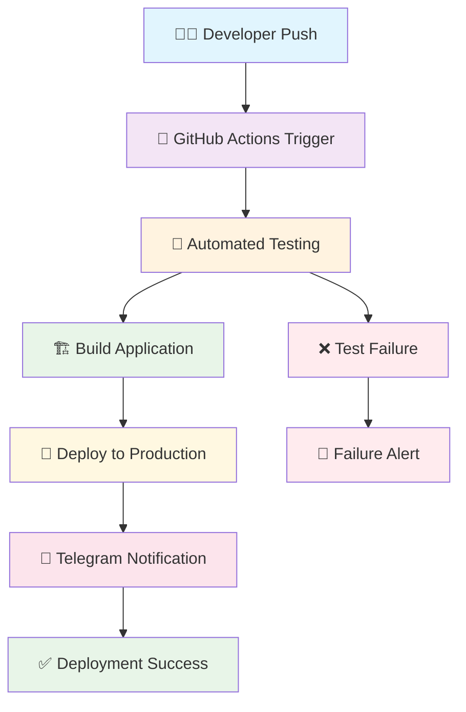

<div align="center">

# 🚢✨ Management Sheet - Import/Export System
## 🎓 **Internship Project Portfolio**

<p align="center">
  
</p>


*🚀 A comprehensive full-stack web application developed during internship, featuring modern technologies, automated deployment, and real-time communications*

[🌐 **Live Demo**](https://prikriti.co.in) • [📚 **API Docs**](https://api.prikriti.co.in/) • [🐛 **Report Bug**](https://github.com/KishanVyas308/Import-Export/issues) • [💡 **Request Feature**](https://github.com/KishanVyas308/Import-Export/issues)

---

### 🎓 **Project Context**
> **Internship Portfolio Project** | **June 2025**  
> Developed as part of my software development internship to demonstrate full-stack development skills, DevOps practices, and modern web technologies.

</div>

---

## 🎯 **Project Overview & Learning Outcomes**

<div align="center">

### 📚 **Skills Demonstrated in This Project**

</div>

<table>
<tr>
<td align="center" width="25%">

<h4>🔧 Full-Stack Development</h4>
<p>React, Node.js, Express, MySQL, Prisma ORM</p>
</td>
<td align="center" width="25%">

<h4>🚀 DevOps & CI/CD</h4>
<p>GitHub Actions, Automated Deployment, Server Management</p>
</td>
<td align="center" width="25%">

<h4>🔗 API Development</h4>
<p>RESTful APIs, Real-time WebSocket, Database Integration</p>
</td>
<td align="center" width="25%">

<h4>📱 Integration</h4>
<p>Telegram Bot, Notifications, Third-party Services</p>
</td>
</tr>
</table>

---

## 🎯 **Automated Deployment Pipeline**

<div align="center">

### 🤖 **Smart CI/CD with Telegram Integration**



</div>

### 🛠️ **Internship Project Achievements**

✅ **Successfully implemented** automated CI/CD pipeline from scratch  
✅ **Integrated** real-time Telegram notifications for deployment status  
✅ **Deployed** production-ready application with SSL and security measures  
✅ **Built** comprehensive full-stack application with modern architecture  
✅ **Demonstrated** problem-solving skills in real-world scenarios  

---

## 📋 **Table of Contents**

<details>
<summary><b>🧭 Navigate through sections</b></summary>

- [🎓 Project Overview & Learning Outcomes](#-project-overview--learning-outcomes)
- [🤖 Automated Deployment Pipeline](#-automated-deployment-pipeline)
- [✨ Technical Features](#-technical-features)
- [🌐 Live Deployment](#-live-deployment)
- [🛠️ Technology Stack](#️-technology-stack)
- [📱 Telegram Integration](#-telegram-integration)
- [🎯 Application Usage](#-application-usage)
- [📸 Project Screenshots](#-project-screenshots)
- [🚀 Getting Started](#-getting-started)
- [🔧 Deployment Guide](#-deployment-guide)
- [📈 Project Learnings](#-project-learnings)
- [🤝 Contributing](#-contributing)
- [📄 License](#-license)

</details>

---

## 🚀 **Project Description**

<div align="center">

</div>

**Management Sheet** is a comprehensive import and export management system that I developed during my internship to demonstrate proficiency in modern web development technologies. This project showcases end-to-end development skills, from conception and design to deployment and maintenance.

### 🎯 **Project Objectives Achieved**

<table>
<tr>
<td align="center" width="33%">

<h4>📚 Learning Goals</h4>
<p>Master full-stack development, DevOps practices, and modern web technologies</p>
</td>
<td align="center" width="33%">

<h4>💼 Business Value</h4>
<p>Create a real-world application that solves logistics management challenges</p>
</td>
<td align="center" width="33%">

<h4>🚀 Innovation</h4>
<p>Implement cutting-edge automation and real-time communication features</p>
</td>
</tr>
</table>

---

## ✨ **Technical Features**

<div align="center">

### 🌟 **Core Capabilities Developed During Internship**

</div>

<table>
<tr>
<td width="50%">

### 🚀 **DevOps & Infrastructure**
- 🤖 **GitHub Actions CI/CD** - Automated build, test, and deployment
- 📱 **Telegram Bot Integration** - Real-time deployment notifications
- 🔒 **SSL/HTTPS Security** - Production-grade security implementation
- 🌐 **Nginx Configuration** - Reverse proxy and load balancing
- 🔄 **PM2 Process Management** - Zero-downtime application management
- 📊 **Monitoring & Logging** - Application health tracking
- 🛡️ **Error Handling** - Comprehensive error management system

</td>
<td width="50%">

### 💻 **Full-Stack Development**
- ⚛️ **React 18** - Modern frontend with hooks and context
- 🔄 **Recoil State Management** - Efficient global state handling
- 🟢 **Node.js & Express** - Scalable backend API architecture
- 🗄️ **Prisma ORM** - Type-safe database operations
- 🐬 **MySQL Database** - Relational data modeling and optimization
- 🔌 **WebSocket Integration** - Real-time bidirectional communication
- 📱 **Responsive Design** - Mobile-first development approach

</td>
</tr>
</table>

---

## 🌐 **Live Deployment**

<div align="center">

### 🚀 **Production Deployment Showcase**

| 🌍 Environment | 🖥️ Frontend | ⚙️ Backend API | 📊 Status | 🔧 Technology |
|----------------|-------------|----------------|-----------|---------------|
| **🚀 Production** | [🌐 prikriti.co.in](https://prikriti.co.in) | [🔗 api.prikriti.co.in](https://api.prikriti.co.in/) |  | Nginx + SSL |
| **📦 Legacy** | [🔗 importexport.udhyog4.co.in](https://importexport.udhyog4.co.in) | [🔗 importexport.udhyog4.co.in/api](https://importexport.udhyog4.co.in/api) |  | Apache + PHP |

</div>

---

## 🛠️ **Technology Stack**

<div align="center">

### 🎨 **Frontend Technologies**


### ⚙️ **Backend Technologies**


### 🚀 **DevOps & Deployment**


### 📱 **Communication & Monitoring**


</div>

---

## 📱 **Telegram Integration**

<div align="center">

### 🤖 **Smart Deployment Notifications**


*One of the key features I implemented during my internship*

</div>

### 📋 **Notification Features Developed**

```yaml
📋 Automated Notifications:
  ✅ Successful Deployments
  ❌ Failed Deployments  
  🔄 Build Progress Updates
  📊 Performance Metrics
  🚨 System Alerts
  📈 Health Check Reports
  🔧 Maintenance Notifications
```

### 📲 **Sample Notification Message**

```
🚀 DEPLOYMENT SUCCESS - Internship Project

✅ Repository: Import-Export
🌟 Branch: main
👤 Developer: KishanVyas308
⏰ Duration: 2m 34s
🔗 Live URL: https://prikriti.co.in

📊 Build Statistics:
  • Tests: ✅ Passed (23/23)
  • Build: ✅ Successful
  • Deploy: ✅ Live
  • SSL: ✅ Active

🎉 Internship project successfully deployed!
📚 Skills demonstrated: Full-stack + DevOps
```

---

## 🎯 **Application Usage**

### 🚀 **Development Environment**

<div align="center">

| 🖥️ **Service** | 🌐 **URL** | 📋 **Purpose** |
|-----------------|------------|----------------|
| **Frontend Dev** | `http://localhost:5173` | React development with hot reload |
| **Backend API** | `http://localhost:3000` | Express.js API server |
| **Database** | `localhost:3306` | MySQL development database |
| **WebSocket** | `ws://localhost:3000` | Real-time communication |

</div>

### 📚 **API Documentation**

<div align="center">
<a href="https://api.prikriti.co.in/">

</a>
</div>

---

## 📸 **Project Screenshots**

<div align="center">

### 🎨 **Internship Project Gallery**

*Showcasing the user interface and functionality I developed*

</div>

<details>
<summary>🔐 <strong>🔥 Authentication System</strong></summary>

<div align="center">


*🛡️ Secure authentication system with JWT tokens and session management*

**Features Implemented:**
- 🔒 JWT-based authentication
- 🛡️ Password encryption
- 🔄 Session management
- 📱 Responsive design
</div>

</details>

<details>
<summary>🏠 <strong>🚀 Main Dashboard</strong></summary>

<div align="center">


*📊 Real-time dashboard with dynamic data visualization and analytics*

**Features Implemented:**
- 📈 Real-time data updates
- 🎯 Interactive charts
- 📊 Performance metrics
- 🔄 Live notifications
</div>

</details>

<details>
<summary>👥 <strong>⚡ User Management Module</strong></summary>

<div align="center">

### 👑 User Administration


### ➕ Client Creation System


### 📝 Registration Workflow


**CRUD Operations Implemented:**
- ✅ Create new users/clients
- 📖 Read user information
- ✏️ Update user profiles
- 🗑️ Delete user accounts
- 🔍 Search and filter functionality

</div>

</details>

<details>
<summary>⚙️ <strong>🔄 Process Management System</strong></summary>

<div align="center">

### 🎛️ Workflow Control


### ✅ Task Tracking


### 📈 Analytics Dashboard


**Advanced Features:**
- 🔄 Workflow automation
- 📊 Progress tracking
- 📈 Performance analytics
- 🎯 Goal achievement metrics

</div>

</details>

<details>
<summary>📊 <strong>💼 Data Management Interface</strong></summary>

<div align="center">


*🎯 Comprehensive data management with advanced filtering and export capabilities*

**Database Features:**
- 🗄️ Relational data modeling
- 🔍 Advanced search functionality
- 📊 Data visualization
- 📄 Export capabilities
- 🔄 Real-time updates
</div>

</details>

---

## 🚀 **Getting Started**

### 📋 **Prerequisites**

<div align="center">


</div>

### ⚡ **Quick Installation**

```bash
# 📥 Clone the internship project
git clone https://github.com/KishanVyas308/Import-Export.git

# 📂 Navigate to project directory
cd Import-Export

# 🔧 Backend setup
cd backend
npm install
cp .env.example .env
# Configure your environment variables in .env

# 🎨 Frontend setup
cd ../frontend
npm install

# 🗄️ Database setup
# Create MySQL database and run migrations
npx prisma migrate dev

# 🚀 Start development servers
# Terminal 1: Backend
cd backend && npm run dev

# Terminal 2: Frontend
cd frontend && npm run dev
```

---

## 🔧 **Deployment Guide**

### 🤖 **Automated Deployment Pipeline**

As part of my internship learning, I implemented a sophisticated CI/CD pipeline:

```yaml
# 🔄 Workflow Configuration
name: Deploy Internship Project

on:
  push:
    branches: [ main ]
  pull_request:
    branches: [ main ]

jobs:
  deploy:
    runs-on: ubuntu-latest
    steps:
      - name: 🔍 Checkout Code
      - name: 🔧 Setup Node.js
      - name: 📦 Install Dependencies
      - name: 🧪 Run Tests
      - name: 🏗️ Build Application
      - name: 🚀 Deploy to Server
      - name: 📱 Send Telegram Notification
```

### 📱 **Telegram Bot Configuration**

**Step-by-step setup I learned during internship:**

1. 🤖 Create bot with [@BotFather](https://t.me/botfather)
2. 🔑 Get bot token from BotFather
3. 🔧 Add `TELEGRAM_BOT_TOKEN` to GitHub Secrets
4. 💬 Get chat ID and add as `TELEGRAM_CHAT_ID`
5. ✅ Test notifications in workflow

---

## 📈 **Project Learnings**

<div align="center">

### 🎓 **Skills Acquired During Internship**

</div>

<table>
<tr>
<td width="50%">

### 💻 **Technical Skills**
- ⚛️ **React Development** - Component architecture, hooks, state management
- 🟢 **Node.js Backend** - API development, middleware, authentication
- 🗄️ **Database Design** - MySQL, Prisma ORM, data modeling
- 🚀 **DevOps Practices** - CI/CD, automated deployment, monitoring
- 🔒 **Security Implementation** - SSL, authentication, data protection
- 📱 **API Integration** - Third-party services, webhooks, notifications

</td>
<td width="50%">

### 🛠️ **Soft Skills**
- 🎯 **Problem Solving** - Debugging, optimization, troubleshooting
- 📋 **Project Management** - Planning, execution, documentation
- 🔄 **Version Control** - Git workflows, collaboration, code reviews
- 📚 **Continuous Learning** - New technologies, best practices
- 💬 **Communication** - Documentation, team collaboration
- ⏰ **Time Management** - Meeting deadlines, prioritization

</td>
</tr>
</table>

### 🏆 **Key Achievements**

- ✅ **Successfully deployed** production-ready application
- ✅ **Implemented** automated CI/CD pipeline from scratch
- ✅ **Integrated** real-time communication features
- ✅ **Developed** comprehensive full-stack solution
- ✅ **Learned** modern development practices and tools
- ✅ **Gained** hands-on experience in DevOps and deployment

---

## 🤝 **Contributing**

<div align="center">

### 🌟 **Internship Project - Open for Feedback!**


*This internship project welcomes feedback, suggestions, and contributions from the developer community*

</div>

### 📝 **How to Contribute**

```bash
# 🍴 Fork the repository
# 🌿 Create your feature branch
git checkout -b feature/ImprovementSuggestion

# ✨ Make your improvements
git commit -m '✨ Add improvement suggestion'

# 🚀 Push to the branch
git push origin feature/ImprovementSuggestion

# 🔄 Open a Pull Request with feedback
```

### 🎯 **Areas for Feedback**
- 🐛 Bug reports and fixes
- ✨ Feature suggestions
- 📚 Documentation improvements
- 🧪 Test coverage enhancement
- 🎨 UI/UX feedback
- 🔒 Security recommendations

---

## 📄 **License**

<div align="center">


This internship project is licensed under the **MIT License** - see the [LICENSE](LICENSE) file for details.

</div>

---

<div align="center">

### 🌟 **Internship Project Showcase**

<a href="https://github.com/KishanVyas308/Import-Export/stargazers">

</a>

<a href="https://github.com/KishanVyas308">

</a>

---

**🎓 Developed during Software Development Internship**  
**🚀 Built with ❤️ and dedication by [KishanVyas308](https://github.com/KishanVyas308)**

### 📊 **Project Timeline**
**Started:** May 2025 | **Completed:** June 2025 | **Deployed:** June 13, 2025

---

### 🎯 **Project Goals Achieved**
✅ Full-stack web development  
✅ DevOps and CI/CD implementation  
✅ Real-time communication integration  
✅ Production deployment experience  
✅ Modern web technologies mastery  

---

*⭐ Star this repository if you found this internship project impressive!*

### 📈 **Development Activity**


</div>
